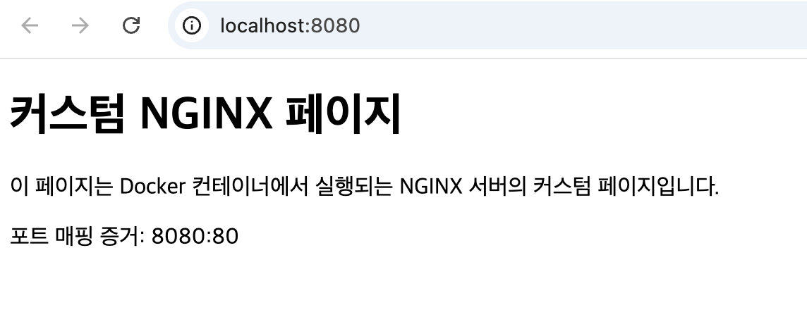

# 개발자 '작업실' 꾸미기 — 개발 워크스테이션 구축

## 1. 프로젝트 개요

리눅스 CLI(터미널), Docker(컨테이너), Git/GitHub를 직접 손으로 세팅하며 "내 컴퓨터에서만 되는" 문제를 줄이고,
재현 가능한 개발 실행 환경을 구성하는 것을 목표로 한다. 터미널로 작업 디렉토리와 권한을 정리하고, Docker를
설치·점검한 뒤 컨테이너를 실행/관리하고, Dockerfile로 웹 서버를 컨테이너화해 포트 매핑·바인드 마운트·볼륨을
직접 검증한다.

## 2. 실행 환경

| 항목 | 값 |
|---|---|
| OS | macOS 15.7.4 (Build 24G517) |
| 터미널 | VSCode 내장 터미널 |
| Shell | /bin/zsh |
| Docker | 28.5.2, build ecc6942 (OrbStack 기반) |
| Docker Compose | v2.40.3 |
| Git | 2.53.0 |

```bash
$ sw_vers
ProductName:    macOS
ProductVersion: 15.7.4
BuildVersion:   24G517

$ echo $SHELL
/bin/zsh

$ git --version
git version 2.53.0

$ docker --version
Docker version 28.5.2, build ecc6942
```

> 서울캠퍼스 sudo 정책 제약으로 Docker Desktop 대신 **OrbStack**을 사용했다. OrbStack 앱을 실행하면 내부적으로
> Docker 엔진이 함께 구동되며, 이후 터미널에서는 `docker` 명령을 동일하게 사용할 수 있다.

## 3. 수행 항목 체크리스트

- [x] 터미널 기본 조작 (pwd/ls -al/mkdir/cd/touch/cat/cp/mv/rm)
- [x] 권한 확인/변경 실습 (파일 1개, 디렉토리 1개)
- [x] Docker 설치 및 점검 (`docker --version`, `docker info`)
- [x] Docker 기본 운영 (`images`, `ps`, `ps -a`, `logs`, `stats`)
- [x] `hello-world` 실행
- [x] `ubuntu` 컨테이너 진입 및 명령 실행
- [x] attach vs exec 차이 관찰
- [x] Dockerfile 기반 커스텀 이미지 (nginx:alpine + 정적 콘텐츠)
- [x] 포트 매핑 브라우저 접속 증거
- [x] 바인드 마운트 전/후 비교
- [x] Docker 볼륨 영속성 검증
- [x] Git 사용자 정보 명시적 설정 + `git config --list` 기록
- [x] VSCode에서 GitHub 로그인 및 저장소 연동
- [x] 트러블슈팅 2건 이상 기록

## 4. 터미널 조작 로그

기본 명령(현재 위치 확인 → 목록 확인(숨김 파일 포함) → 생성/이동 → 파일 내용 확인/생성 → 복사 → 이름변경 → 삭제) 흐름:

```bash
$ pwd
/Users/k.jimin20022503/Desktop

$ ls -al
total 16
drwx------+  5 k.jimin20022503  k.jimin20022503   160  7 29 10:31 .
drwxr-x---+ 20 k.jimin20022503  k.jimin20022503   640  7 29 10:50 ..
-rw-r--r--@  1 k.jimin20022503  k.jimin20022503  6148  7 29 10:31 .DS_Store
-rw-r--r--   1 k.jimin20022503  k.jimin20022503     0  7 29 10:13 .localized
drwxr-xr-x   8 k.jimin20022503  k.jimin20022503   256  7 29 10:31 codyssey_w1

$ mkdir dir1
$ cd dir1
$ touch memo.txt
$ echo "hello" > memo.txt
$ cat memo.txt
hello

$ cp memo.txt memo_cp.txt
$ ls
memo_cp.txt memo.txt

$ mv memo_cp.txt rename.txt
$ ls
memo.txt   rename.txt

$ rm rename.txt
$ ls -al
total 8
drwxr-xr-x  3 k.jimin20022503  k.jimin20022503   96  7 29 10:54 .
drwx------+ 6 k.jimin20022503  k.jimin20022503  192  7 29 10:50 ..
-rw-r--r--  1 k.jimin20022503  k.jimin20022503    6  7 29 10:50 memo.txt
```

전체 터미널 캡처: [docs/images/term_log.png](docs/images/term_log.png)

**절대 경로 vs 상대 경로**: `pwd`가 보여준 `/Users/k.jimin20022503/Desktop/dir1`은 루트(`/`)부터 시작하는
**절대 경로**다. 반면 `cd dir1`이나 `mv memo_cp.txt rename.txt`에서 쓰인 `dir1`, `memo_cp.txt`는 **현재 위치를
기준으로 한 상대 경로**로, 같은 파일이라도 실행 위치가 바뀌면 다른 결과를 가리킬 수 있다.

## 5. 권한 실습 (파일 1개 + 디렉토리 1개, 전/후 비교)

```bash
$ ls -l
total 8
-rw-r--r--  1 k.jimin20022503  k.jimin20022503   6  7 29 10:50 memo.txt
drwxr-xr-x  2 k.jimin20022503  k.jimin20022503  64  7 29 10:57 perm

# --- 변경 전 ---
# memo.txt : -rw-r--r-- (644)
# perm/    : drwxr-xr-x (755)

$ chmod 600 memo.txt
$ ls -l memo.txt
-rw-------  1 k.jimin20022503  k.jimin20022503  6  7 29 10:50 memo.txt

$ chmod 700 perm
$ ls -ld perm
drwx------  2 k.jimin20022503  k.jimin20022503  64  7 29 10:57 perm
# --- 변경 후 ---
# memo.txt : -rw------- (600, 소유자만 읽기/쓰기)
# perm/    : drwx------ (700, 소유자만 읽기/쓰기/실행)
```

전체 캡처: [docs/images/permission.png](docs/images/permission.png)

**r/w/x 및 755·644 해석**: 권한은 소유자(owner)/그룹(group)/기타(other) 3자리로 나뉘고, 각 자리는
r=4, w=2, x=1의 합으로 표현된다. `644`는 `rw-r--r--` — 소유자는 읽기/쓰기(6), 그룹과 기타는 읽기만(4) 가능하다.
`755`는 `rwxr-xr-x` — 소유자는 읽기/쓰기/실행(7), 그룹과 기타는 읽기/실행(5)만 가능하다. 디렉토리의 실행(x)
권한은 "그 디렉토리 안으로 들어갈 수 있는지"를 의미한다.

## 6. Docker 설치 · 점검 · 운영 로그

### 설치/점검

```bash
$ docker --version
Docker version 28.5.2, build ecc6942

$ docker info
Client:
 Version:    28.5.2
 Context:    orbstack
 Debug Mode: false

Server:
 Containers: 0
  Running: 0
  Paused: 0
  Stopped: 0
 Images: 0
 Server Version: 28.5.2
 Storage Driver: overlay2
 Kernel Version: 6.17.8-orbstack-...
 Operating System: OrbStack
 OSType: linux
 Architecture: x86_64
 CPUs: 6
 Total Memory: 15.67GiB
```

전체 캡처: [docs/images/docker_checking.png](docs/images/docker_checking.png)

`docker info`가 데몬 관련 오류 없이 Server 정보를 정상 출력 → OrbStack의 Docker 엔진이 정상 동작 중임을 확인.

### 이미지 다운로드/목록

```bash
$ docker pull nginx
Using default tag: latest
latest: Pulling from library/nginx
...
Status: Downloaded newer image for nginx:latest

$ docker images
IMAGE          ID           DISK USAGE  CONTENT SIZE  EXTRA
nginx:latest   5a88c9c45479   240MB       66MB
```

캡처: [docs/images/docker_pull_images.png](docs/images/docker_pull_images.png)

### 컨테이너 실행/중지/목록

```bash
$ docker run -d --name test nginx
54c1fadfed2a665af1aff308b677e341c917ceccc51f865ce8f1bb964f8a6284

$ docker ps
CONTAINER ID   IMAGE   COMMAND                  CREATED         STATUS         PORTS    NAMES
54c1fadfed2a   nginx   "/docker-entrypoint...."  4 seconds ago   Up 4 seconds   80/tcp   test

$ docker stop test
test

$ docker ps -a
CONTAINER ID   IMAGE   COMMAND                  CREATED          STATUS                     NAMES
54c1fadfed2a   nginx   "/docker-entrypoint...."  21 seconds ago   Exited (0) 4 seconds ago   test
```

캡처: [docs/images/docker_run_stop.png](docs/images/docker_run_stop.png)

### 로그 확인 & 리소스 확인

```bash
$ docker start test
test

$ docker logs test
...
2026/07/29 08:11:19 [notice] 1#1: start worker processes
...
2026/07/29 08:11:36 [notice] 1#1: signal 3 (SIGQUIT) received, shutting down
...
2026/07/29 08:12:34 [notice] 1#1: start worker processes
...

$ docker stats --no-stream
CONTAINER ID   NAME   CPU %   MEM USAGE / LIMIT    MEM %   NET I/O        BLOCK I/O     PIDS
54c1fadfed2a   test   0.00%   6.27MiB / 15.69GiB   0.04%   1.13kB / 126B  9.92MB / 0B   7
```

캡처: [docs/images/docker_log_resource.png](docs/images/docker_log_resource.png)

### 정리

```bash
$ docker stop test && docker rm test
test
test

$ docker ps
CONTAINER ID   IMAGE   COMMAND   CREATED   STATUS   PORTS   NAMES
(없음)
```

캡처: [docs/images/docker_stop.png](docs/images/docker_stop.png)

## 7. 컨테이너 실습 (hello-world / ubuntu / attach vs exec)

### hello-world

```bash
$ docker run hello-world
Hello from Docker!
This message shows that your installation appears to be working correctly.
...
```

캡처: [docs/images/docker_hello-world.png](docs/images/docker_hello-world.png)

### ubuntu 진입 및 내부 명령

```bash
$ docker run -it --name ubt ubuntu
root@5e6348c848aa:/# ls
bin  boot  dev  etc  home  lib  lib64  media  mnt  opt  proc  root  run  sbin  srv  sys  tmp  usr  var
root@5e6348c848aa:/# echo "hello"
hello
```

캡처: [docs/images/docker_ubt.png](docs/images/docker_ubt.png)

### attach vs exec 차이 관찰

메인 프로세스를 `bash`로 두고(`-dit`), `exec` 진입 후 `exit`한 경우와 `attach` 후 `exit`한 경우를 비교했다.

```bash
$ docker run -dit --name ubt2 ubuntu bash
cddca44bc1e5e589148a08a792f7c8ce3de7e674714cafa83940647d85ceb60c

# ① exec 로 진입 → exit
$ docker exec -it ubt2 bash
root@cddca44bc1e5:/# exit
exit

$ docker ps
CONTAINER ID   IMAGE     COMMAND   CREATED          STATUS          NAMES
cddca44bc1e5   ubuntu    "bash"    45 seconds ago   Up 44 seconds   ubt2
# → exec 로 만든 셸만 종료됨. 컨테이너 본체(PID 1)는 계속 살아있음

# ② attach 로 메인 프로세스에 직접 연결 → exit
$ docker attach ubt2
root@cddca44bc1e5:/# exit
exit

$ docker ps -a
CONTAINER ID   IMAGE     COMMAND   CREATED          STATUS                     NAMES
cddca44bc1e5   ubuntu    "bash"    About a minute ago  Exited (0) 3 seconds ago  ubt2
# → attach 는 PID 1(메인 프로세스)에 직접 연결되므로, exit 하면 컨테이너 자체가 종료됨
```

캡처: [docs/images/troubleshooting/docker_attach.png](docs/images/troubleshooting/docker_attach.png)

| 구분 | 연결 대상 | `exit`(또는 종료 시그널) 결과 |
|---|---|---|
| `docker exec -it <c> bash` | 컨테이너 안에 **새로 추가한** 프로세스 | 그 프로세스만 종료, 컨테이너는 계속 실행(Up) |
| `docker attach <c>` | 컨테이너의 **메인 프로세스(PID 1)** | 메인 프로세스 종료 = 컨테이너 종료(Exited) |

이 차이를 발견하게 된 과정(원래는 `sleep 3600`을 메인 프로세스로 두고 `attach` 후 Ctrl+C로 테스트했다가
컨테이너가 죽지 않아 당황했던 경험)은 12번 트러블슈팅 항목에 별도로 정리했다.

## 8. Dockerfile 기반 커스텀 이미지 제작

- **선택한 기존 베이스**: (A) 웹 서버 베이스 이미지 활용 — `nginx:alpine` 공식 이미지
- **커스텀 포인트**

| 적용 내용 | 목적 |
|---|---|
| `COPY app/index.html /usr/share/nginx/html/index.html` | nginx 기본 환영 페이지를 내가 작성한 정적 콘텐츠로 교체 |
| `ENV SERVICE_NAME=web` | 서비스 식별 값을 이미지 코드가 아닌 환경변수로 분리(설정과 코드의 분리) |

`Dockerfile`:

```dockerfile
FROM nginx:alpine

COPY app/index.html /usr/share/nginx/html/index.html

ENV SERVICE_NAME=web
```

`app/index.html` (발췌):

```html
<h1>커스텀 NGINX 페이지</h1>
<p>이 페이지는 Docker 컨테이너에서 실행되는 NGINX 서버의 커스텀 페이지입니다.</p>
```

빌드/실행:

```bash
$ docker build -t my-web:1.0 .
...
#6 [2/2] COPY app/index.html /usr/share/nginx/html/index.html
#7 exporting to image
#7 writing image sha256:623c35ae937632041870c577bcbea1467f7a71af26d8620b7831b61ccc822930 done
#7 naming to docker.io/library/my-web:1.0 done

$ docker images
REPOSITORY   TAG   IMAGE ID       CREATED         SIZE
my-web       1.0   623c35ae9376   8 seconds ago   62.4MB

$ docker run -d --name my-web -p 8080:80 my-web:1.0
89a31357ba27f21ce1f7e9869eb4a1b859f7195ba9e41cc5ba855cbff18f413a

$ docker ps --filter name=my-web
CONTAINER ID   IMAGE        COMMAND                  STATUS                  PORTS                          NAMES
89a31357ba27   my-web:1.0   "/docker-entrypoint..."  Up Less than a second   0.0.0.0:8080->80/tcp           my-web
```

## 9. 포트 매핑 접속 증거

`-p 8080:80`으로 실행한 뒤 `curl`과 브라우저로 각각 접속을 확인했다.

```bash
$ curl http://localhost:8080
<!DOCTYPE html>
<html lang="ko">
...
	<h1>커스텀 NGINX 페이지</h1>
	<p>이 페이지는 Docker 컨테이너에서 실행되는 NGINX 서버의 커스텀 페이지입니다.</p>
	<p>포트 매핑 증거: 8080:80</p>
</body>
</html>
```



## 10. 바인드 마운트 & 볼륨 영속성 검증

### 10-A. 바인드 마운트 (호스트 변경 → 컨테이너 재시작 없이 즉시 반영 확인)

호스트의 디렉토리를 nginx 컨테이너에 마운트한 뒤, 컨테이너를 재시작하지 않고 호스트 파일만 수정해서
바로 반영되는지 확인했다.

```bash
$ docker run -d --name bind-web -p 8081:80 -v <host_dir>:/usr/share/nginx/html nginx:alpine
4221a906f49bc28c67f7f379264efc106d4b7217ac7e241facfb78d391d45682

# --- 변경 전 ---
$ curl -s http://localhost:8081
<h1>bind mount BEFORE host edit</h1>

# --- 호스트에서 index.html 내용을 직접 수정 (컨테이너는 재시작하지 않음) ---
$ echo '<h1>bind mount AFTER host edit - reflected without restart</h1>' > <host_dir>/index.html

# --- 변경 후: 같은 컨테이너, 같은 요청인데 내용이 즉시 바뀜 ---
$ curl -s http://localhost:8081
<h1>bind mount AFTER host edit - reflected without restart</h1>

$ docker ps --filter name=bind-web --format "table {{.Names}}\t{{.Status}}"
NAMES      STATUS
bind-web   Up 6 seconds   # 재시작 없이 같은 컨테이너로 반영됨을 확인

$ docker rm -f bind-web
```

**관찰**: 바인드 마운트는 호스트 디렉토리를 컨테이너 내부 경로에 그대로 연결하는 방식이라, 컨테이너를
재빌드·재시작하지 않고 호스트에서 파일만 바꿔도 즉시 반영된다.

### 10-B. Docker 볼륨 (컨테이너 삭제 후에도 데이터 유지)

```bash
$ docker volume create my-data
my-data

$ docker volume ls
DRIVER    VOLUME NAME
local     my-data

$ docker run -d --name vol-test -v my-data:/data ubuntu sleep infinity
e88074fadc6a9570847bad50ca2488f2d1b84060e82e62a68ff1487233960c0a

$ docker exec vol-test sh -c 'echo "이 데이터는 컨테이너를 지워도 살아남는다" > /data/proof.txt && cat /data/proof.txt'
이 데이터는 컨테이너를 지워도 살아남는다

# --- 컨테이너를 완전히 삭제 ---
$ docker rm -f vol-test
vol-test

$ docker ps -a --filter name=vol-test
CONTAINER ID   IMAGE   COMMAND   CREATED   STATUS   PORTS   NAMES
(없음 — vol-test 컨테이너가 완전히 사라짐)

# --- 같은 볼륨을 새 컨테이너에 연결 ---
$ docker run -d --name vol-test2 -v my-data:/data ubuntu sleep infinity
b918e4c2854aedf28c4b05d502840addd979b2ddda1118bb1ab1e5d20b7230c4

$ docker exec vol-test2 cat /data/proof.txt
이 데이터는 컨테이너를 지워도 살아남는다   # 삭제 전과 동일한 내용 확인 → 데이터 영속성 증명

$ docker rm -f vol-test2
$ docker volume rm my-data
```

**관찰**: 컨테이너의 파일시스템은 컨테이너 삭제와 함께 사라지는 휘발성 저장소이지만, 볼륨은 Docker가
호스트 쪽에 별도로 관리하는 저장소라 컨테이너의 생명주기와 분리된다. `vol-test`를 완전히 삭제한 뒤에도
동일한 볼륨을 연결한 `vol-test2`에서 같은 데이터를 그대로 읽을 수 있었다.

## 11. Git / GitHub / VSCode 연동

`user.name`, `user.email`, `init.defaultBranch`를 명시적으로 설정했다. 이메일은 개인정보 노출을 피하기 위해
GitHub가 제공하는 noreply 주소(`{GitHub user id}+{username}@users.noreply.github.com`)를 사용했다 —
실제 개인 이메일이 커밋 기록에 남지 않으면서도 GitHub 계정과는 정상적으로 연결된다.

```bash
$ git config --global user.name "강지민"
$ git config --global user.email "225418468+ji-min0@users.noreply.github.com"
$ git config --global init.defaultBranch main

$ git config --list
credential.helper=osxkeychain
user.name=강지민
user.email=225418468+ji-min0@users.noreply.github.com
init.defaultbranch=main
core.repositoryformatversion=0
core.filemode=true
core.bare=false
core.logallrefupdates=true
core.ignorecase=true
core.precomposeunicode=true
remote.origin.url=https://github.com/ji-min0/codyssey_w1.git
remote.origin.fetch=+refs/heads/*:refs/remotes/origin/*
branch.main.remote=origin
branch.main.merge=refs/heads/main
```

> 참고: 이 설정 이전에 만든 과거 커밋들의 작성자 정보는 호스트네임 기반 자동 설정 값(`강지민
> <k.jimin20022503@...codyssey.kr>`) 그대로 남아있다. 과거 히스토리를 다시 쓰지는 않았고,
> 이 설정 이후의 신규 커밋부터 위 GitHub noreply 이메일로 기록된다.

VSCode에서 GitHub 로그인 후 커밋/푸시가 정상 동작함을 확인:

```
$ git add .
$ git commit -m "init: add initial Dockerfile, README.md, and docker-compose.yml"
[main (root-commit) 738cd81] init: add initial Dockerfile, README.md, and docker-compose.yml
 3 files changed, 0 insertions(+), 0 deletions(-)

$ git push --set-upstream origin main
...
branch 'main' set up to track 'origin/main'.
```

커밋 로그:

```
commit a9185ae ... (HEAD -> main, origin/main, origin/HEAD)
    chore: add .DS_Store to .gitignore
commit 0a243d9 ...
    docs: include GitHub VSCode image in documentation
commit 738cd81 ...
    init: add initial Dockerfile, README.md, and docker-compose.yml
```

캡처: [docs/images/github_vscode.png](docs/images/github_vscode.png), [docs/images/github_vsconde_commit_log.png](docs/images/github_vsconde_commit_log.png)

## 12. 트러블슈팅

### 트러블슈팅 1: `docker attach` 후 Ctrl+C를 눌러도 컨테이너가 종료되지 않음

- **문제**: `sleep 3600`을 메인 프로세스로 실행한 컨테이너에 `docker attach` 후 Ctrl+C를 여러 번 눌렀지만
  컨테이너가 계속 `Up` 상태였고, CLI는 `got 3 SIGTERM/SIGINTs, forcefully exiting`만 출력했다.
- **원인 가설**: Ctrl+C(SIGINT)가 컨테이너에 전달되지 않았거나 무시된 것으로 추정.
- **확인**: 리눅스 커널은 PID 1에 한해 핸들러가 등록되지 않은 시그널의 기본 동작을 적용하지 않는다.
  `sleep`은 SIGINT/SIGTERM 핸들러가 없어 PID 1로 실행되면 해당 시그널을 무시한다. 마지막 메시지는 컨테이너가
  아니라 **docker CLI가 attach 연결을 강제로 끊었다는 뜻**이었다.
- **해결/대안**: 메인 프로세스를 `bash`로 바꿔(`docker run -dit ubuntu bash`) `attach` 후 `exit` 명령으로
  종료 → 컨테이너가 정상적으로 `Exited` 상태가 됨을 확인. 동일 컨테이너에 `exec -it ... exit`을 했을 때는
  컨테이너가 살아있는 것과 비교해 attach/exec의 차이를 확인했다. (관련 캡처: 7번 섹션)

문제 발생 시점(전) 캡처: [docs/images/troubleshooting/docker_container_is_running.png](docs/images/troubleshooting/docker_container_is_running.png)
해결 후(후) 캡처: [docs/images/troubleshooting/docker_attach.png](docs/images/troubleshooting/docker_attach.png)

### 트러블슈팅 2: `git commit --amend`가 서로 다른 두 커밋을 하나로 합쳐버림

- **문제**: 이미 커밋된 두 개의 커밋(A: 포트 매핑 기록, B: git config 기록) 중 A의 메시지만 한 줄 형식으로
  고치려고 `git reset --soft HEAD~1`(B의 변경사항을 staged 상태로 되돌림) 후 `git commit --amend -m "..."`를
  실행했는데, 커밋 후 확인해보니 A 하나에 A+B의 변경사항이 모두 들어가 있고 커밋이 1개로 줄어들어 있었다.
- **원인 가설**: `git commit --amend`는 메시지만 바꾸는 명령이 아니라 **현재 staging area 상태를 그대로
  포함해서** 직전 커밋을 다시 만드는 명령이라는 것을 놓쳤다. `reset --soft`로 B의 변경사항이 이미 staged된
  상태였기 때문에, amend가 그 staged 내용까지 A 커밋에 합쳐버린 것으로 추정.
- **확인**: `git show --stat HEAD`로 amend 직후 커밋을 확인하니 원래 A 혼자였을 때보다 변경 파일 수·라인 수가
  더 많았고(README.md 외 diff가 늘어남), `git status`에는 아무 것도 남아있지 않아 B의 변경사항이 통째로
  A에 흡수된 것을 확인했다.
- **해결/대안**: 두 커밋 모두 아직 push 되지 않은 로컬 커밋이라 안전하게 되돌릴 수 있었다. `git reflog`로
  amend 이전의 원본 커밋 해시(A, B 각각)를 찾은 뒤, `git reset --hard <원본 A 해시>`로 정확히 A 상태로
  복원하고 `git commit --amend -m "..."`로 메시지만 교체(이때는 staging area가 비어 있어 내용이 섞이지
  않음)했다. 이어서 `git cherry-pick --no-commit <원본 B 해시>`로 B의 변경사항만 다시 가져와 별도 커밋으로
  분리했다. 교훈: 커밋을 amend하기 전에는 반드시 `git status`로 staging area가 비어 있는지 먼저 확인한다.

## 13. 보너스

- [x] Compose 기초 (단일 서비스)
- [x] Compose 멀티 컨테이너 + 네트워크 통신
- [x] Compose 운영 명령 (up/down/ps/logs)
- [x] 환경 변수로 포트/모드 변경
- [ ] GitHub SSH 키 설정

### 13-A. Compose 기초 (단일 서비스)

기존 `Dockerfile`을 그대로 빌드 소스로 사용하는 `web` 서비스 하나만 정의했다.

`docker-compose.yml`:

```yaml
services:
  web:
    build: .
    container_name: my-web
    ports:
      - "8080:80"
    environment:
      - SERVICE_NAME=web
```

```bash
$ docker compose up -d --build
 codyssey_w1-web  Built
 Network codyssey_w1_default  Created
 Container my-web  Started

$ docker compose ps
NAME     IMAGE             COMMAND                   SERVICE   STATUS         PORTS
my-web   codyssey_w1-web   "/docker-entrypoint..."   web       Up             0.0.0.0:8080->80/tcp

$ curl -s http://localhost:8080
...
	<h1>커스텀 NGINX 페이지</h1>
	<p>포트 매핑 증거: 8080:80</p>
</body>
</html>
```

**배운 점**: `docker run -p 8080:80 my-web:1.0` 같은 1회성 실행 명령이 `docker-compose.yml`이라는
파일 하나로 문서화되어, 누구나 같은 명령(`docker compose up`) 한 번으로 동일한 환경을 재현할 수 있게 된다.

### 13-B. 멀티 컨테이너 + 네트워크 통신

`web` 서비스에 `cache`(redis:alpine) 서비스를 추가했다. 두 서비스는 compose가 자동으로 만들어주는
같은 브리지 네트워크에 속하므로, 서로 IP 대신 **서비스 이름**으로 통신할 수 있는지 확인했다.

`docker-compose.yml` (추가분):

```yaml
services:
  web:
    build: .
    container_name: my-web
    ports:
      - "8080:80"
    environment:
      - SERVICE_NAME=web
    depends_on:
      - cache

  cache:
    image: redis:alpine
    container_name: my-cache
```

```bash
$ docker compose up -d
 Container my-cache  Started
 Container my-web  Running

$ docker compose ps
NAME       IMAGE             SERVICE   STATUS          PORTS
my-cache   redis:alpine      cache     Up              6379/tcp
my-web     codyssey_w1-web   web       Up              0.0.0.0:8080->80/tcp

# --- web 컨테이너 안에서 cache 라는 이름으로 접근 가능한지 확인 ---
$ docker compose exec web getent hosts cache
192.168.97.3      cache  cache

$ docker compose exec web ping -c 2 cache
PING cache (192.168.97.3): 56 data bytes
64 bytes from 192.168.97.3: seq=0 ttl=64 time=0.066 ms
64 bytes from 192.168.97.3: seq=1 ttl=64 time=0.071 ms
--- cache ping statistics ---
2 packets transmitted, 2 packets received, 0% packet loss

$ docker compose exec web nc -zv cache 6379
cache (192.168.97.3:6379) open
```

**관찰**: `cache`라는 서비스 이름이 실제 컨테이너의 IP(`192.168.97.3`)로 자동 해석(DNS)됐고, ping과
redis 포트(6379) 접속까지 성공했다. 컨테이너 IP는 재시작할 때마다 바뀔 수 있지만, compose 네트워크의
서비스 디스커버리 덕분에 코드/설정에서는 IP 대신 `cache`라는 이름만 알면 된다.

### 13-C. Compose 운영 명령 (up / ps / logs / down)

```bash
$ docker compose logs --tail=10 web
my-web  | 2026/07/30 08:42:09 [notice] 1#1: start worker processes
my-web  | 2026/07/30 08:42:09 [notice] 1#1: start worker process 30
...
my-web  | 192.168.97.1 - - [30/Jul/2026:08:42:10 +0000] "GET / HTTP/1.1" 200 385 "-" "curl/8.7.1" "-"

$ docker compose logs --tail=5 cache
my-cache  | 1:M 30 Jul 2026 08:44:09.803 * Ready to accept connections tcp
my-cache  | 1:M 30 Jul 2026 08:44:09.803 # WARNING: Redis does not require authentication...

$ docker compose down
 Container my-web    Stopped / Removed
 Container my-cache  Stopped / Removed
 Network codyssey_w1_default  Removed

$ docker compose ps
NAME   IMAGE   COMMAND   SERVICE   CREATED   STATUS   PORTS
(없음 — down 이후 서비스 전부 정리됨)
```

**정리한 운영 루틴**: `up -d`(기동) → `ps`(살아있는지 확인) → `logs`(정상 동작/에러 확인) → 필요시
`down`(컨테이너+네트워크까지 한 번에 정리). 개별 컨테이너를 `docker stop/rm`으로 하나씩 정리하는 대신,
compose 단위로 전체 스택의 상태를 일관되게 확인·정리할 수 있었다.

### 13-D. 환경 변수로 포트/모드 변경

`.env` 파일로 포트와 nginx 로그 모드를 코드 변경 없이 바꿀 수 있게 분리했다.

`.env`:
```
WEB_PORT=8080
NGINX_ENTRYPOINT_QUIET_LOGS=
```

`docker-compose.yml` (해당 부분):
```yaml
    ports:
      - "${WEB_PORT:-8080}:80"
    environment:
      - SERVICE_NAME=web
      - NGINX_ENTRYPOINT_QUIET_LOGS=${NGINX_ENTRYPOINT_QUIET_LOGS}
```

**실행 1 — 기본값(포트 8080, verbose 모드)**:

```bash
$ docker compose up -d
$ curl -s -o /dev/null -w "http_status=%{http_code} port=8080\n" http://localhost:8080
http_status=200 port=8080

$ docker logs my-web 2>&1 | grep -c "docker-entrypoint.sh"
7   # entrypoint 준비 로그가 그대로 출력됨 (verbose)
```

**실행 2 — `.env`만 바꿔서 포트/모드 전환 (코드 변경 없음)**:

```bash
# .env
WEB_PORT=9090
NGINX_ENTRYPOINT_QUIET_LOGS=1

$ docker compose up -d
$ curl -s -o /dev/null -w "http_status=%{http_code} port=9090\n" http://localhost:9090
http_status=200 port=9090

$ curl -s -o /dev/null -w "http_status=%{http_code} port=8080\n" --max-time 2 http://localhost:8080
http_status=000 port=8080   # 기존 포트는 더 이상 매핑되지 않음

$ docker logs my-web 2>&1 | grep -c "docker-entrypoint.sh"
0   # NGINX_ENTRYPOINT_QUIET_LOGS=1 → entrypoint 로그가 억제됨 (quiet)
```

**관찰**: `docker-compose.yml`이나 `Dockerfile`을 전혀 건드리지 않고 `.env` 값만 바꿔서 노출 포트와
nginx 실행 로그 모드(verbose/quiet)를 동시에 바꿀 수 있었다. 설정값이 이미지/코드에서 분리되어 있으면,
같은 이미지를 다른 환경(dev/staging/prod)에 재사용하기 쉬워진다.
